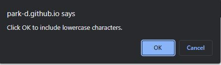

# Module-3 Challenge: JavaScript: Password Generator

## Description

In order to learn javascript, I modified starter code to create an application that enables the user to generate random passwords based on criteria that they’ve selected. This app runs in the browser and features dynamically updated HTML and CSS powered by JavaScript code that I wrote.

## Installation

N/A

## Usage

Application deployed at the following link: https://park-d.github.io/module-3/

When a user needs a new secure password, they can click the "Generate Password" button on the screen, to be presented with a prompt that asks for required password length. They must choose a password length between 8-128 or they will receive an alert window telling them to choose a proper length. After choosing the proper length, the user can choose which criteria to be included in the randomly generated password through a series of pop-up windows: Uppercase characters, lowercase characters, numeric characters, and special characters. If they do not choose at least one character type, they will receieve another alert window telling them to choose at least one criteria. Finally, a password is generated based on the selected criteria and displayed in the box on screen. 

## License

N/A